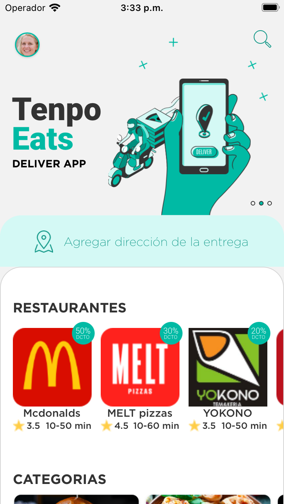
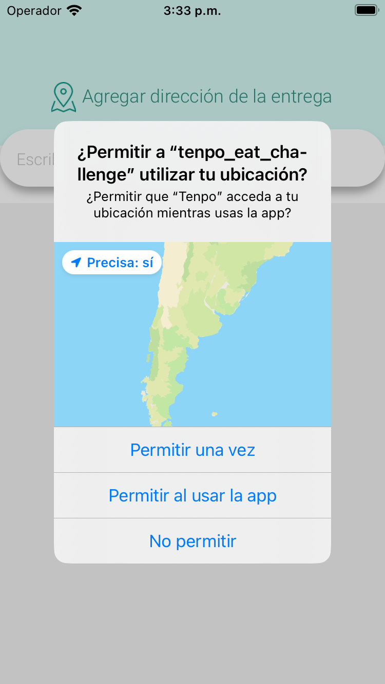
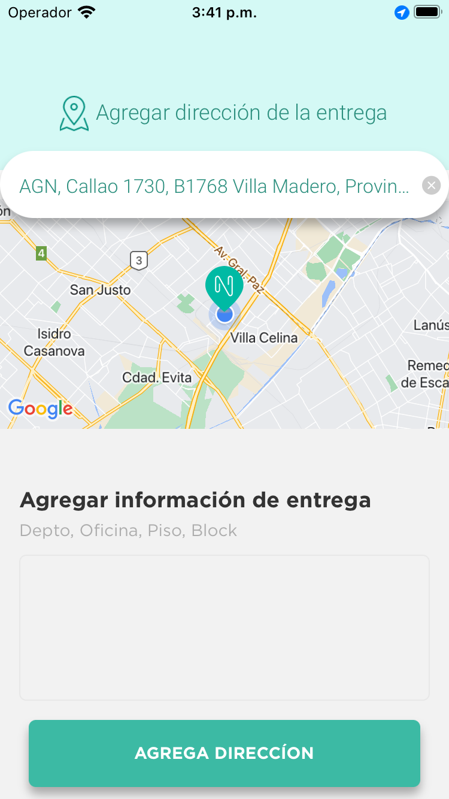
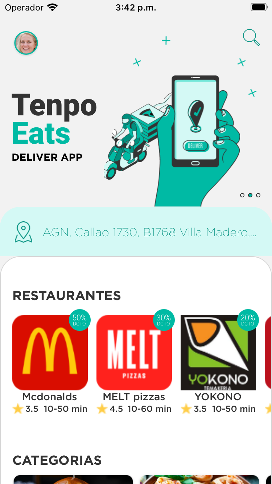
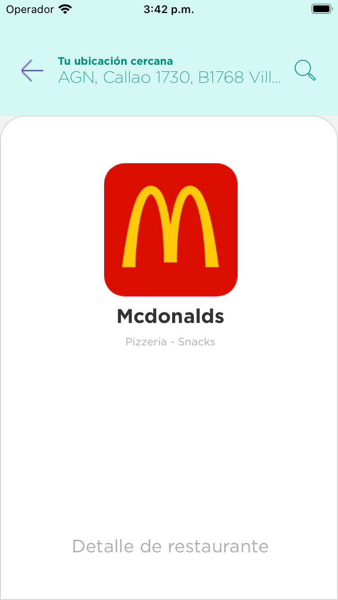
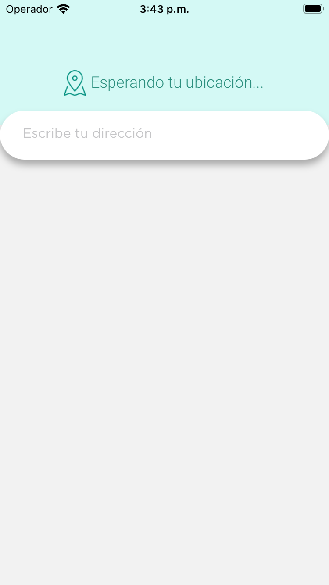
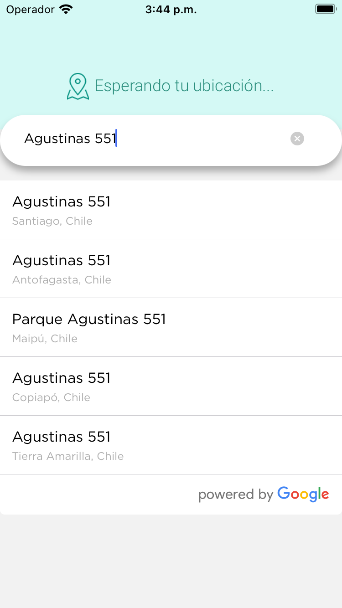
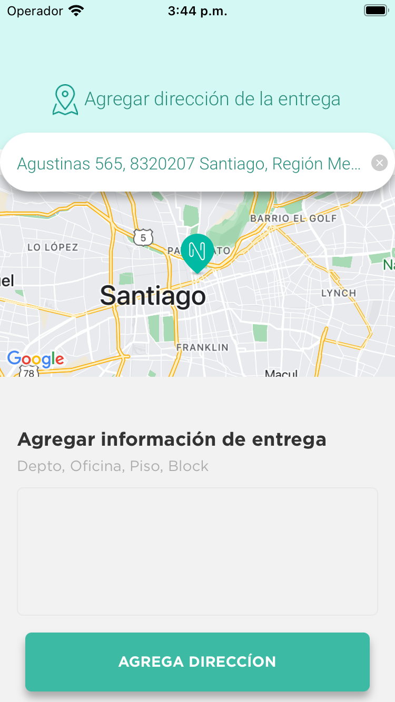

## TENPO CHALLENGE

Thanks for this opportunity and let me show some of my pasion.

This is a [React Native](https://reactnative.dev/) project.
<hr/>

## Getting Started

First, after clone this repo, run the development server:

**_NOTE:_** Create file `.env` with data in `.env-example` (or clone it and change the name just: `.env` )

```bash
yanr
# and
yarn ios
# or
yarn android
# and for test
yarn test
```

#### Available Scripts 💻

In the project directory, you can run:

- `yarn` (Install all dependencies)
- `yarn ios` (Runs the app in the ios emulator in development mode.)
- `yarn android` (Runs the app in the android emulator in development mode.)
- `yarn lint` (Runs the eslint above app.)
- `yarn test` (Runs the tests above app.)
- `yarn test:coverage` (Runs the tests above app and get a coverage report.)

- Node Version: v16.15.1
- Yarn Version: v1.22.10

This site was inspired at Figma to [DIGITAL HOUSE](https://www.figma.com/proto/AIMJp1Y6Gfv9PmQ8lYmUy8/Code-challenge?node-id=6%3A649&scaling=scale-down&page-id=0%3A1&starting-point-node-id=6%3A649)

#### Inspirations 🤯 🧠

- 🌈 🌎 Vitto 🌎 🏹
- Midudev: [midudev - Youtube](https://www.youtube.com/channel/UC8LeXCWOalN8SxlrPcG-PaQ)
- FaztWeb: [FaztWeb](https://www.faztweb.com/)
- Feranndo Herrera: [Ferando Herrera - Youtube](https://www.youtube.com/c/FernandoHerreraCr)
- Simon Grimm: [Simon Grimm - Youtube](https://www.youtube.com/channel/UCZZPgUIorPao48a1tBYSDgg)

### Tools 🧩

- VSCode: [https://code.visualstudio.com/](https://code.visualstudio.com/)
- React Native: [https://reactnative.dev/](https://reactnative.dev/)
- Postman: [https://www.postman.com/](https://www.postman.com/)
- Jest: [https://jestjs.io/](https://jestjs.io/)
- StackOverflow: [https://stackoverflow.com/](https://stackoverflow.com/) 😅
- OSX Macbook

<hr/>

### Screenshots 📱

## WITH PERMISSION: "Permitir una vez"







## WITHOUT PERMISSION: "No Permitir"






Sebastian Roger Loguzzo! 🌎
